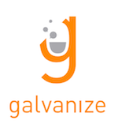
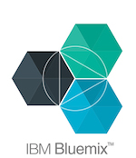
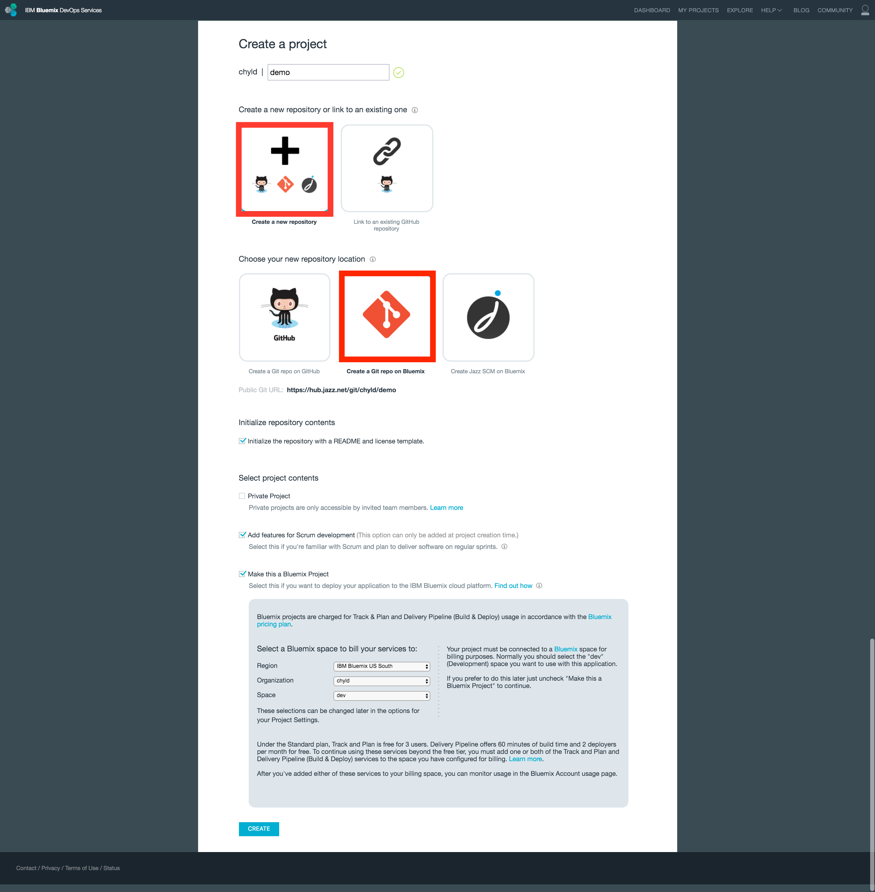
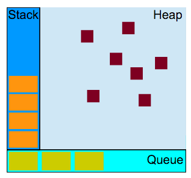
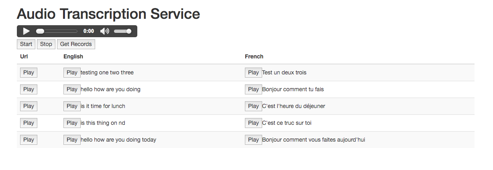
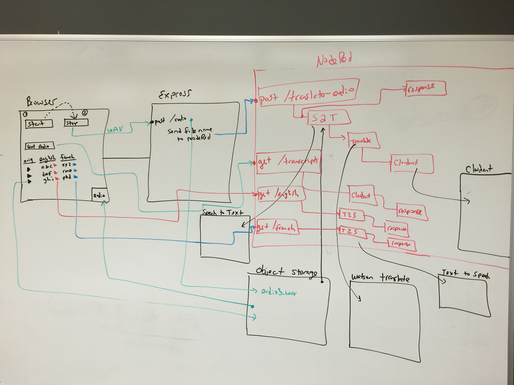

# IBM Cloud Advisor 101 Course





## Cohort 2016-05-23

### Food Schedule
  - Monday: 8am - 5pm (Breakfast and Lunch served)
  - Tuesday - Friday: 9am - 5pm
  - Friday: 5pm (Hosted Happyhour on Rooftop)

### Coding Schedule
  - Monday: Fundamentals, Backend
  - Tuesday: DevOps, Cloud Foundry, OpenWhisk, NodeRED
  - Wednesday: Fullstack Apps with Microservices
  - Thursday: Fullstack Apps with Microservices
  - Friday: Hackathon

### Syllabus

#### Arrive & Setup
  - Meet & Greet + Breakfast
  - Get on Network (g|events -> machinelearning)

#### Introductions
  - Roll Call, Verify Emails
  - Students
  - Instructor
  - About Galvanize, http://www.galvanize.com/
  - Course Overview
  - Distribute Badges
  - Hackathon Videos
    - https://www.youtube.com/playlist?list=PLHtrWoWKwFxGwbKzdpg6AWiQkapH-xpMm

#### Bluemix Garage
  - https://www.ibm.com/cloud-computing/bluemix/garage/
  - Presentation
  - Design Thinking

#### Assessment
  - Technical
  - Cloud
  - Agile

#### Cloud 9 Setup
  - https://c9.io/
  - Create a Custom Ubuntu Workspace
  - Open Terminal

```sh
rm README.md
wget https://raw.githubusercontent.com/chyld/devops/master/c9-setup.sh
chmod +x c9-setup.sh
./c9-setup.sh
rm c9-setup.sh
vi ~/.gitconfig
exit
```

  - To follow me on C9: [Chyld's C9](https://ide.c9.io/chyld/bluemix)

#### Git & JazzHub
  - [Git](http://git-scm.com/)
  - [JazzHub](https://hub.jazz.net/)

#### JazzHub


#### Git Commands
```sh
# To clone an existing repository
git clone https://github.com/BluemixCloud/2016-03-28

# To initialize an empty git repository
git init

# To check the status of your repository
git status

# To see all the local and remote branches
git branch -av

# To check your remote repository
git remote -v

# To see all of your commits
git log

# To push your code up to the remote repository
git add .
git commit -am "enter a commit message here"
git pull
git push
```

#### Modern Programming Fundamentals
  - Demo using C9
  - JavaScript, https://developer.mozilla.org/en-US/docs/Web/JavaScript
  - Node.js, https://nodejs.org/en/
  - Module system
  - Node Package Manager, https://www.npmjs.com/
  - Pair Programming
  - Test Driven Development: [Mocha](https://mochajs.org/) | [Chai](http://chaijs.com/)



#### Project 0
  - This project will be done as a pair
  - Pick a project manager
  - The PM will go here, https://hub.jazz.net/project/chyld/fundamentals
  - PM, click the "Fork Project" button
    - Name the project: fundamentals
    - Check all the boxes
    - Click Create
  - PM, click the "Members" link on the left, add your partner to the repository
  - Both people can now push and pull the repository
  - Both, on the project page, click the "Git URL" link
  - Both, copy that link
  - Both, open C9 terminal
  - Both, make sure you're in the `~/workspace` directory

```sh
git clone <link you copied above>
cd fundamentals
npm install
npm test test/square.js # this should pass
npm test test/add.js # this fails, fix
npm test # to run all tests
```

  - Fix the remaining tests
  - Take turns, with both people fixing the failing tests
  - Push your completed code up the repository

#### Backend
  - HTTP, https://www.w3.org/Protocols/rfc2616/rfc2616.txt
  - Methods: `get, post, put, delete`
  - Use `http` Linux client on `cnn.com` and others
  - [https://stamplay.com](https://stamplay.com)
  - Create Model - Create, Update, Select & Delete
  - `http VERB https://____.stamplayapp.com/api/cobject/v1/MODEL a=b c=3 d=1/2/2015 e=true`
  - [Express.js](http://expressjs.com/)
  - Performance: CPU Bound, Memory Bound, I/O Bound
  - Async programming with callbacks & promises
  - Node.js perf test with Apache Bench
  - Run sequentially `-c 1`, then run in parallel `-c 1000`
  - `ab -n __ -c __ http://0.0.0.0:8080/`
  - Compare perf to Rails app
  - Create simple index.html page - serve with `http-server`
  - Build Basic Express App
    - `req.params`
    - `req.body`
  - Have the Express app use the `request` npm module to interface with the Stamplay MongoDB
    - Create Dog
    - Update Dog
    - List Dogs
    - Delete Dog

#### DevOps Services
  - https://hub.jazz.net/
  - JazzHub
  - Code Editor
  - Track & Plan
  - Build Pipeline
    - Use `manifest.yml` from [Backend](https://hub.jazz.net/project/chyld/backend)
    - Build a Stage
    - Add Jobs to a Stage
    - Jobs can be re-ordered

#### Cloud Foundry
  - https://www.cloudfoundry.org/
  - `cf api https://api.ng.bluemix.net`
  - `cf login`
  - `cf target`
  - `cf marketplace`
  - `cf apps`
  - `cf services`
  - `cf --help`

#### OpenWhisk
  - Distributed, Event Driven Compute
  - [Notes & Lab](openwhisk.md)
  - To call from other code
    - `Content-Type: application/json`
    - `Authorization: Basic <based64 encoded key>`
    - [Base64 Utility](https://www.base64encode.org/)
    - `POST https://openwhisk.ng.bluemix.net/api/v1/namespaces/{org_space}/actions/{action-name}?blocking=true`

#### NodeRED
  - http://nodered.org/
  - https://console.ng.bluemix.net/catalog/starters/node-red-starter/
  - Additional Nodes & Flows, http://flows.nodered.org/
  - Create basic NodeRED flows, exercise functionality

#### Chrome Plugins
  - [JSON Formatter](https://chrome.google.com/webstore/detail/json-formatter/bcjindcccaagfpapjjmafapmmgkkhgoa)
  - [Angular Inspector](https://chrome.google.com/webstore/detail/ng-inspector-for-angularj/aadgmnobpdmgmigaicncghmmoeflnamj)

#### Front End Technologies
  - Browser
  - Angular, JavaScript MVC Framework, https://angularjs.org/
  - Twitter Bootstrap CSS Framework, http://getbootstrap.com/
  - Highcharts Analytical Charting, http://www.highcharts.com/

#### Project 1
  - [Fullstack Template](https://hub.jazz.net/project/chyld/full-stack-template)
  - Fork and Clone Template
  - Angular Demo
    - Scalar Variables
    - Array and Object Variables
    - Mustache Syntax
    - `$scope`
    - `ng-click` and `function`
    - Bootstrap
    - Show Trending Games on Twitch, https://api.twitch.tv/kraken/games/top

#### Project 2
Adding items to a Trello ToDo list via SMS

- Prerequisites
  - [Twilio Phone Numbers](https://www.twilio.com/user/account/messaging/phone-numbers)
  - [Stamplay](https://stamplay.com/)
  - [Trello](https://trello.com/)

Steps

1. Stamplay: Make a webhook, call it `todo`. Test the webhook with `http` client.
2. Twilio: Edit your Phone Number. Change messaging to `post` to the Stamplay webhook from Step 1.
3. Send a text message to Twilio. The data should appear in Stamplay debugger.
4. Trello: Create a Board
5. Trello: Create a List
6. Stamplay: Create a Task. The Task will wire up the webhook and the Trello board
7. Send a text message. The message should appear in your Trello board list.

#### Project 3
Display the Top Story from ANY Reddit Topic and Display in Slack

- Prerequisites
  - [NodeRED](https://console.ng.bluemix.net/catalog/starters/node-red-starter/)
  - [Slack](https://slack.com/)
  - [Slack Outgoing Webhooks](https://api.slack.com/outgoing-webhooks)
  - [OpenWhisk](https://new-console.ng.bluemix.net/openwhisk/)

Steps

1. If you are not an Administrator on Slack, [Create Your Team Account](https://slack.com/create)
2. Sign into your Slack account and create a channel
3. NodeRED: Create an `post /reddit`. Test from `http` client.
4. Create an Outgoing Webhook on Slack. Use the `reddit` as the trigger word
5. Send a message from your slack channel to NodeRED. You should have debugging info displayed.
6. Create an OpenWhisk action. Deploy and Test it.

  ```js
  var Request = require('request');

  function main(params){
    var channel = params.channel;
    var url = 'https://www.reddit.com/' + channel + '.json';
    Request({url: url, json: true}, function(e, r, b){
      console.log('error:', e);
      console.log('status:', r.statusCode);
      var first = b.data.children[0].data;
      whisk.done({payload: {title: first.title, url: first.url}});
    });

    return whisk.async();
  }
  ```

7. NodeRED: Prepare the data before the call to OpenWhisk.


  ```js
  var channel = msg.payload.text;

  channel = channel.replace(/reddit/g, '');
  channel = channel.trim();

  msg.payload = {channel: channel};

  return msg;
  ```

8. NodeRED: After the call to OpenWhisk, prepare the data to be sent back to your slack channel.

  ```js
  var data = msg.payload.payload;

  msg.payload = {
      text: data.title + ' ' + data.url
  };

  return msg;
  ```


#### Project 4
A user fills out a customer response form. The form gets analyzed by Watson Tone Analyzer with the results streamed in realtime to your slack channel.

- Prerequisites
  - [WuFoo](http://www.wufoo.com/)
  - [NodeRED](https://console.ng.bluemix.net/catalog/starters/node-red-starter/)
  - [Slack](https://slack.com/)
  - [Stamplay](https://stamplay.com/)
  - [Tone Analyzer](https://console.ng.bluemix.net/catalog/services/tone-analyzer/)

Steps

1. Create a form on WuFoo
2. The form should have two fields, a name field and feedback field
3. Get the subdomain name and API key for your form
4. Go to Stamplay, Under Tasks -> Components
5. Connect to Slack and WuFoo
6. Make a Code Block called `wufoo`

  ```js
  module.exports = function(context, cb) {
    var Request = require('request');
    var data = context.data;
    var url = 'http://_____your_node_red.mybluemix.net/wufoo';

    if(data.data){
  	data = data.data;
      data = JSON.parse(data.replace(/\n|\r/g, ''));
    }

    console.log('data:', data);

    Request({url: url, json: true, method: 'post', body: data}, function(e, r, b){
  	cb(null, { payload : b});
    });
  } ;
  ```

7. Create a Task
8. WuFoo -> Code Block
9. Send data to the Code Block

  ```js
  {
  "name" : "{{entry.body.Field8}}",
  "feedback" : "{{entry.body.Field4}}"
  }
  ```

10. Create a simple `post /wufoo` endpoint in NodeRED
11. Fill out the form and look at the deugging info
12. You may need to change the code in step 9
13. Go back to NodeRED and add a prep function before the Tone Analyzer

  ```js
  msg.save = msg.payload;
  msg.payload = msg.save.feedback;
  return msg;
  ```

14. Add a Tone Analyzer node
15. Tones -> Emotion, Sentences -> True
16. Add some post processing after the Tone Analyzer, before the data gets sent back to Stamplay

  ```js
  var tones = msg.response.document_tone.tone_categories[0].tones;

  tones = tones.map(function(t){
      return t.tone_name + ': ' + (t.score * 100).toFixed(2) + '%';
  });

  var text = msg.save.name + ' -- ' + tones.join(', ');

  msg.payload = {text: text};

  return msg;
  ```

17. Add some debugging nodes. Make sure all looks good.
18. Go back to Stamplay. Add another Task.
19. Code Block -> Slack
20. Have your `wufoo` Code Block, upon execution, insert a message into a Slack channel that you choose.
21. Test everything out

#### Project 5
  - Twitter Sentiment Analysis
  - Prerequisites
    - [NodeRED](https://console.ng.bluemix.net/catalog/starters/node-red-starter/)
    - [OpenWhisk](https://new-console.ng.bluemix.net/openwhisk/)
    - [SQL Database](https://console.ng.bluemix.net/catalog/services/sql-database/)
  - Fork and Clone the [Fullstack Template](https://hub.jazz.net/project/chyld/full-stack-template)
  - Use NodeRED to create a flow that collects data from Twitter, performs Sentiment Analyis and inserts all that data into a DB2 SQL Database.
  - Create another flow to query the database and send back the result as JSON.
  - Create a button in Angular that will fetch all the data and display the data in a table and graph.

Code that aggregates the tweet + sentiment analysis data; ready for insertion into DB2.

```js
var place;

if(msg.location){
    place = msg.location.place;
}

msg.payload = {
    SCORE: msg.sentiment.score,
    TWEET: msg.tweet.text,
    USERNAME: msg.tweet.user.screen_name,
    LOCATION: place || 'unknown',
    CREATED_AT: 'TIMESTAMP'
};

return msg;
```

Script that creates the table inside DB2. Where the tweet data will be stored.

```sql
create table tweets
(
  id integer not null generated always as identity (start with 1 increment by 1),
  primary key (id),
  score integer,
  tweet varchar(256),
  username varchar(256),
  location varchar(256),
  created_at timestamp
);
```

SQL to collect all the tweet data from DB2.

```sql
select * from tweets;
```

Angular code to draw a chart using Highcharts.

```js
function drawChart(tweets){
  $('#graph').highcharts({
    title: {
      text: 'Tweet Sentiment Analysis'
    },
    xAxis: {
       categories: tweets.map(function(t, i){return i})
    },
    series: [
     {
       data: tweets.map(function(t){return t.SCORE})
     }
    ]
  });
}
```

#### Project 6
  - SMS Get Stock Quote
  - Prerequisites
    - [OpenWhisk](https://new-console.ng.bluemix.net/openwhisk/)
    - [Twilio Credentials](https://www.twilio.com/user/account/messaging/dashboard)
    - [Twilio Phone Numbers](https://www.twilio.com/user/account/messaging/phone-numbers)
    - [Twilio API](http://twilio.github.io/twilio-node/)
    - [Stock Quote Service](http://dev.markitondemand.com/MODApis/)
  - Fork and Clone the [Fullstack Template](https://hub.jazz.net/project/chyld/full-stack-template)
  - A user sends an SMS message to Twilio -> Express -> OpenWhisk -> Quote Service
  - The service returns a current stock quote to the user's phone

#### Project 7
  - Slack Get Current Weather Forecast
  - Prerequisites
    - [OpenWhisk](https://new-console.ng.bluemix.net/openwhisk/)
    - [Slack Account](https://slack.com/)
    - [Slack Outgoing Webhooks](https://api.slack.com/outgoing-webhooks)
    - [Weather Service](http://openweathermap.org/current)
    - [Weather Sign Up](http://home.openweathermap.org/users/sign_up)
    - [Weather API Key](https://home.openweathermap.org/api_keys)
  - Fork and Clone the [Fullstack Template](https://hub.jazz.net/project/chyld/full-stack-template)
  - User opens a slack channel, asks for the current weather for their zip code
  - Slack -> Express -> OpenWhisk -> Weather Service
  - The retured weather forcast gets displayed in the slack channel

#### Project 8
  - Camera Image Capture & Watson Analyis
  - Prerequisites
    - [Webcam.js](https://pixlcore.com/read/WebcamJS)
    - [Object Storage](https://console.ng.bluemix.net/catalog/services/object-storage/)
    - [NodeRED](https://console.ng.bluemix.net/catalog/starters/node-red-starter/)
    - [Visual Recognition](https://console.ng.bluemix.net/catalog/services/visual-recognition/)
    - [Cloudant](https://console.ng.bluemix.net/catalog/services/cloudant-nosql-db/)
  - Fork and Clone the [Fullstack Template](https://hub.jazz.net/project/chyld/full-stack-template)
  - User snaps a photo of herself using the laptop's webcam.
  - The photo gets uploaded to Object Storage.
  - Then the photo gets pulled into NodeRED, gets analyzed by Watson Visual Recognition
  - That data gets stored in a Cloudant database
  - A browser will query the Cloudant database and display all the results

#### Project 9
  - Microphone Audio Capture, Speech Translation
  - Prerequisites
    - [Object Storage](https://console.ng.bluemix.net/catalog/services/object-storage/)
    - [NodeRED](https://console.ng.bluemix.net/catalog/starters/node-red-starter/)
    - [Cloudant](https://console.ng.bluemix.net/catalog/services/cloudant-nosql-db/)
    - [Language Translation](https://console.ng.bluemix.net/catalog/services/language-translation/)
    - [Text to Speech](https://console.ng.bluemix.net/catalog/services/text-to-speech/)
    - [Speech to Text](https://console.ng.bluemix.net/catalog/services/speech-to-text/)
  - Fork and Clone the [Fullstack Template](https://hub.jazz.net/project/chyld/full-stack-template)





Buttons inside HTML

```html
<button ng-click="startRec()">Start</button>
<button ng-click="stopRec()">Stop</button>
```

Place at the bottom of your angular code in index.js

```js
var audio_context;
var recorder;

initAudio();

function startUserMedia(stream) {
  var input = audio_context.createMediaStreamSource(stream);
  recorder = new Recorder(input);
}

function initAudio(){
  try {
    window.AudioContext = window.AudioContext || window.webkitAudioContext;
    navigator.getUserMedia = navigator.getUserMedia || navigator.webkitGetUserMedia || navigator.mozGetUserMedia;
    window.URL = window.URL || window.webkitURL;

    audio_context = new AudioContext;
  } catch (e) {
    alert('No web audio support in this browser!');
  }

  navigator.getUserMedia({audio: true}, startUserMedia, function(e) {
    console.log('No live audio input: ' + e);
  });
}

function uploadAudio(){
  recorder && recorder.exportWAV(function(blob) {
    var formData = new FormData();
    formData.append("voice", blob);
    var request = new XMLHttpRequest();
    request.open("post", "/audio");
    request.send(formData);
  });
}
```

Functions to start and stop recording - also upload to server

```js
 $scope.startRec = function(){
    console.log('Recording: Start');
    recorder && recorder.record();
  };

  $scope.stopRec = function(){
    console.log('Recording: Stop');
    recorder && recorder.stop();
    uploadAudio();
    recorder.clear();
  };
```

REST API Endpoint in Express.js that will upload audio to NodeRED

```js
var os = new ObjectStorage('user_id', 'password', 'project_id', 'container_name', 'access_point_url');
os.setContainerPublicReadable();

app.post('/audio', uploadr.single('voice'), function(req, res){
  var name = 'audio-original-' + uuid.v1() + '.wav';
  os.uploadFileToContainer(name, req.file.mimetype, req.file.buffer, req.file.size)
  .then(function(file){
    var o = {url: 'http://___your_node_red___.mybluemix.net/translate-audio', json: true, method: 'post', body: {url: file}};
    request(o, function(e, r, b){
      res.send({payload: 'success'});
    });
  });
});
```

#### Hackathon
  - http://bluemixathon.devpost.com/
  - https://vimeo.com/137915648
  - http://www.linkedin.com/pulse/so-you-want-run-corporate-hackathon-vinod-ralh
  - Split into groups of 3 or 4
  - Each team build an application using Bluemix services and deploys using DevOps services
  - At the conclusion of the hackathon, each team demos their app to the class

#### Retrospective

#### Feedback
  - https://docs.google.com/a/galvanize.com/forms/d/1jRT3EE_acCe_V8iWA77nU8sdqhbBmIiHUsAiMVQt4Eo/viewform

#### Tour
  - Galvanize
  - Full Stack Classrooms
  - Data Science Classrooms
  - Bluemix Garage
  - Cloudant
  - Startups

#### Happy Hour on Roof

#### Collect Badges

# REFERENCES

### Bluemix Services
  - [SQL Database](https://console.ng.bluemix.net/catalog/services/sql-database/)
  - [Cloudant](https://console.ng.bluemix.net/catalog/services/cloudant-nosql-db/)
  - [Object Storage](https://console.ng.bluemix.net/catalog/services/object-storage/)
  - [Language Translation](https://console.ng.bluemix.net/catalog/services/language-translation/)
  - [Visual Recognition](https://console.ng.bluemix.net/catalog/services/visual-recognition/)
  - [Text to Speech](https://console.ng.bluemix.net/catalog/services/text-to-speech/)
  - [Speech to Text](https://console.ng.bluemix.net/catalog/services/speech-to-text/)

### Books
  - [You Don't Know JS 6-book series](https://github.com/getify/You-Dont-Know-JS)
  - [Eloquent JavaScript](http://eloquentjavascript.net/)
  - [Learning JavaScript Design Patterns](https://addyosmani.com/resources/essentialjsdesignpatterns/book/)
  - [Human JavaScript](http://read.humanjavascript.com/ch04-organizing-your-code.html)
  - [JavaScript Allonge](https://leanpub.com/javascript-allonge/read)
  - [Speaking JavaScript](http://speakingjs.com/es5/)

### Reference Links
  - [DB2 Data Types](https://www-01.ibm.com/support/knowledgecenter/SSEPGG_10.5.0/com.ibm.db2.luw.sql.ref.doc/doc/r0008483.html?cp=SSEPGG_10.5.0%2F2-12-2-3)
